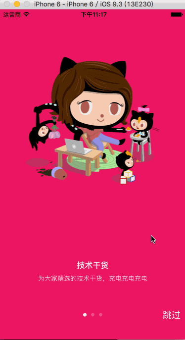
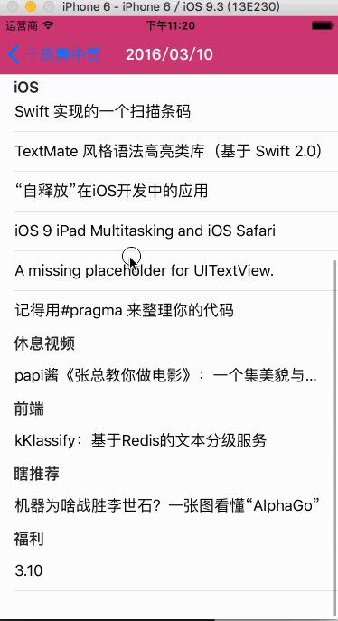

# GankMeizi 干货集中营

最近在抽空学习使用 Swift 结合 Rx 开发 iOS App  

## 截图

  

## 开始

从最开的的 ruby 安装，

## cocopods 和 carthage 安装与对比

## 设计工具与参考

### 参考

* [Android 开源项目妹子&amp;gank.io](https://github.com/drakeet/Meizhi)  
参考了其中的使用 Rx 调用 Gank.io API 逻辑部分 和 UI 功能
* [iOS 开源项目-beauties](https://github.com/liushuaikobe/beauties)  
参考其项目使用的开源项目，在进行初步的了解以后尝试搭建 iOS 的项目框架
* [通过LaunchScreen自定义启动动画
](http://www.jianshu.com/p/2f1149269cd0)  
这里将启动放到了`- (void)viewDidLoad;`里面  ，如果放到`- (void)viewDidAppear:(BOOL)animated;`会有闪白屏  
* [Carthage 初探：四大优势与四大劣势](http://imtx.me/archives/1939.html)
### 设计工具

* [Materail Design Color](http://www.materialpalette.com/)  
使用 MD Color Theme ，在线自由搭配
* [Icons: octocats](https://octodex.github.com/)  
没有美工设计，自己又不擅长，就直接使用了 gitcat `^_^` 在`https://octodex.github.com/`找到了[momtocat](https://octodex.github.com/momtocat)和[femalecodertocat](https://octodex.github.com/femalecodertocat)  
* [移动应用图标生成工具](http://icon.wuruihong.com/#/home)  
能够在线快速生成所有尺寸的应用图标，而且名称也都修改好了，下载下来直接替换 iOS 里的`AppIcon.appiconset`即可

TO BE CONTINUE ...  

## 开源库
1. Alamofire (3.4.0)  
  `Moya`依赖项

* CHTCollectionViewWaterfallLayout (0.9.4)  
  瀑布流布局

* CocoaLumberjack (2.3.0)  
  日志记录

* DACircularProgress (2.3.1)
* DZNEmptyDataSet (1.8.1)

* EAIntroView (2.8.3)
* EARestrictedScrollView (1.1.0)  
  欢迎页

* IDMPhotoBrowser (1.8.4)  
  图片浏览

* MJRefresh (3.1.0)  
  上下拉刷新

* Moya (6.4.0)  
  封装`Alamofire`的网络请求

* ObjectMapper (1.3.0)  
  entity 与 json 互转

* Result (2.0.0)
* RxBlocking (2.5.0)
* RxCocoa (2.5.0)
* RxSwift (2.5.0)
* RxTests (2.5.0)  
  Rx for iOS

* SDWebImage (3.7.6)  
  图片缓存
* SwiftyUserDefaults (2.2.0)  
  App 设置项

* pop (1.0.9)  
  `IDMPhotoBrowser`依赖项

## 感谢
